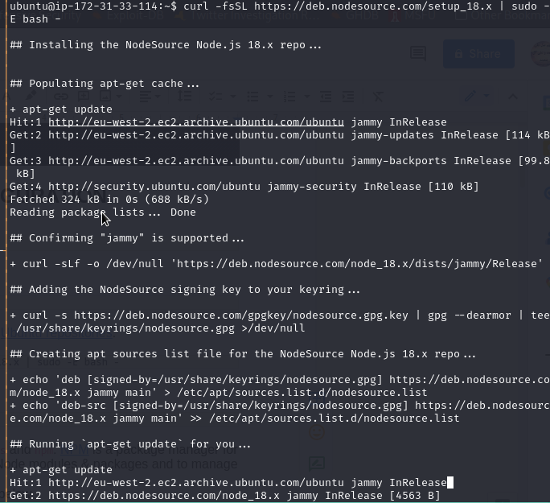
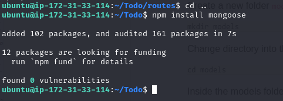
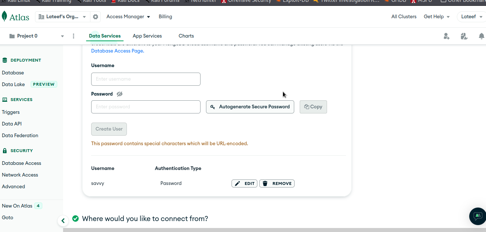
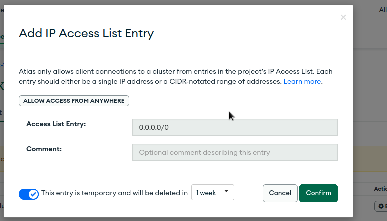
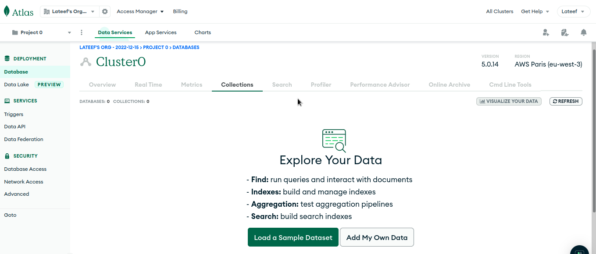
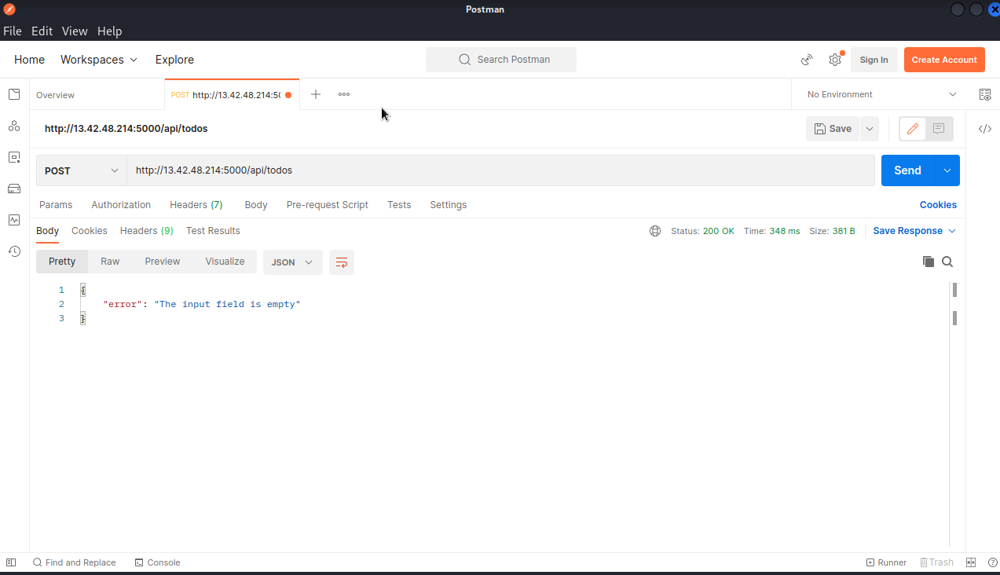
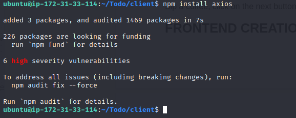
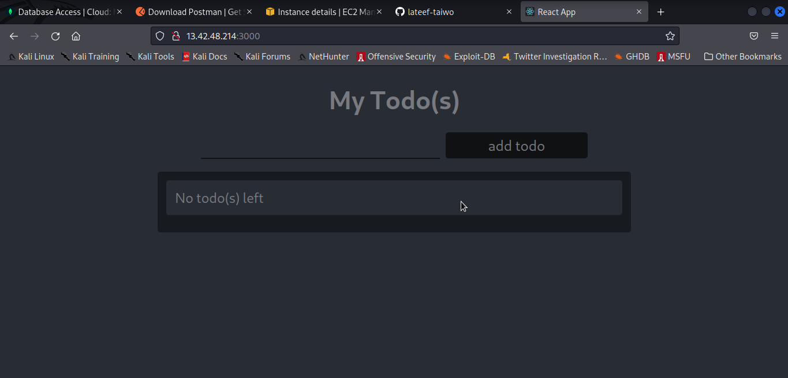

# TO-DO-APP-ON-AWS-USING-MERN-WEB-STACK
This repository explains the steps involved in creating a To-Do application on AWS using the MERN web stack. The MERN web stack consists of MongoDB, ExpressJS, ReactJS, and NodeJS as its working components. 
Full-stack online applications can be deployed more quickly and easily with the MERN Stack, a Javascript stack.
The MERN Stack is made up of the following 4 technologies: MongoDB, Express, React, and Node.js.

* Mongo-DB: MongoDB is a source-available cross-platform document-oriented database program. Classified as a NoSQL database program, MongoDB uses JSON-like documents with optional schemas.
* ExpressJS: A server-side Web Application framework for Node.js.
* ReactJS: A frontend framework developed by Facebook. It is based on JavaScript, used to build User Interface (UI) components.
* Nodejs:
It is intended to simplify and streamline the development process.
Each of these four technologies plays a significant role in the creation of web apps and offers developers an end-to-end environment in which to operate. 

### This is the Architectural diagram of the Todo App and how users/clients with interact with it.
The client communicates with the frontend via a web browser.

---
____
## Step 1 - Create a Virtual Server on AWS
<!-- UL -->
* Login to the AWS console
* Search for EC2 (Elastic Compute Cloud) 
* Select your preferred region (the closest to you) and launch a new EC2 instance of t2.micro family with Ubuntu Server 20.04 LTS (HVM)
* Type a name e.g My_Lamp_Server
 Click create a new key pair, use any name of your choice as the name for the pem file and select .pem.
    * Linux/Mac users, choose .pem for use with openssh. This allows you to connect to your server using open ssh clients.
    * For windows users choose .ppk for use with putty. Putty is a software that lets you connect remotely to servers
* Save your private key (.pem file) securely and do not share it with anyone! If you lose it, you will not be able to connect to your server ever again! 

* On your local computer, open the terminal and change directory to the Downloads folder, type 
    
    `$ cd ~/Downloads` 
* Change permissions for the private key file (.pem), otherwise you can get an error “Bad permission”
    
    ` sudo chmod 0400 <private-key-name>. pem` 
* Connect to the instance by running
    ` ssh -i <private-key-name>. pem ubuntu@<Public-IP-address>`

<!-- Horizontal RUle -->
---
___
## Step 2 - Backend Configuration
* Update Ubuntu

    `sudo apt update`

* Upgrade ubuntu

    `sudo apt upgrade`

* Since we are using Ubuntu as our server, we will get the location of Node.js software from Ubuntu repositories.

    `curl -fsSL https://deb.nodesource.com/setup_18.x | sudo -E bash -`

* Install Node.js with the command below

    `sudo apt-get install -y nodejs`

* Verify the node installation with the command below

`node --version && npm --version` or `node -v && npm -v`

The command above checks the version of node and npm installed. npm is a package manager for node.

* Application Code Setup
Create a new directory for your To-Do project and run the `ls` command to verify that Todo directory is created.

    `mkdir TOdo`

    `ls`

* Now change your current directory to the newly created one:

    `cd Todo`

* Next, you will use the command `npm init` to initialise your project, so that a new file named package.json will be created. This file will  contain information about your application and the dependencies that it needs to run.

    `npm init`

    

* Install ExpressJS
Express is a framework for Node.js, so we can install it using the npm package manager

    `npm install express`

    

* Now create an file index.js and type `ls` to check the contents of the directory

    `touch index.js`
    `ls`

    

* Next. Install the dotenv module

    `npm install dotenv`

    

* Open the index.js file in the vim editor and type the code below into it and save.

    `vim index.js`

        const express = require('express');
        require('dotenv').config();
        
        const app = express();
        
        const port = process.env.PORT || 5000;
        
        app.use((req, res, next) => {
        res.header("Access-Control-Allow-Origin", "\*");
        res.header("Access-Control-Allow-Headers", "Origin, X-Requested-With, Content-Type, Accept");
        next();
        });
        
        app.use((req, res, next) => {
        res.send('Welcome to Express');
        });
        
        app.listen(port, () => {
        console.log(`Server running on port ${port}`)
        });

* Now start the server to see if it works. Open your terminal in the same directory as your index.js file and type:

    `node index.js`

* Ensure you have port 5000 opened in EC2 security groups because the application will be running on that port. Also open port 80 for web access.

* Open up your browser and try to access your server’s Public IP or Public DNS name followed by port 5000:

`http://<PublicIP-or-PublicDNS>:5000`

----------

### Routes
There are three actions that our To-Do app should be able to do:

* Create a new task
* Display list of all tasks
* Delete a completed task

Each task will be associated with some particular endpoint and will use different standard HTTP request methods: POST, GET, DELETE.

For each task, we need to create routes that will define various endpoints that the To-do app will depend on. 

 * Create a folder routes .
 * Change directory to routes folder.
 * create a file api.js using the `touch api.js` commad

    `mkdir routes`

    `cd routes`

    `touch api.js`

    

* Open the file in the vim editor and paste the code below in it.

        const express = require ('express');
        const router = express.Router();
        
        router.get('/todos', (req, res, next) => {
        
        });
        
        router.post('/todos', (req, res, next) => {
        
        });
        
        router.delete('/todos/:id', (req, res, next) => {
        
        })
        
        module.exports = router;

    

*   Now we need to create models

    Models are data structures that we use to define the shape of our data. We need to create a model for the app to make use of Mongodb which is a NoSQL database. We will also use models to define the database schema. Schema is a representation of how the database will be constructed.

* Change directory to Todo folder using `cd ..` and install Mongoose.

    `npm install mongoose`

    

 * Create a new directory models.

* Change directory into the newly created models directory.

* create a new file todo.js.
    
    Use the command below to do the above in one shot

    `mkdir models && cd models && touch todo.js`
   
* Open the todo.js file in the vim editor and paste the code below:

        const mongoose = require('mongoose');
        const Schema = mongoose.Schema;
        
        //create schema for todo
        const TodoSchema = new Schema({
        action: {
        type: String,
        required: [true, 'The todo text field is required']
        }
        })
        
        //create model for todo
        const Todo = mongoose.model('todo', TodoSchema);
        
        module.exports = Todo;

*  we need to update our routes from the file api.js in ‘routes’ directory to make use of the new model.
In Routes directory, open api.js with `vim api.js`, delete the code inside with `:%d` command.

        const express = require ('express');
        const router = express.Router();
        const Todo = require('../models/todo');
        
        router.get('/todos', (req, res, next) => {
        
        //this will return all the data, exposing only the id and action field to the client
        Todo.find({}, 'action')
        .then(data => res.json(data))
        .catch(next)
        });
        
        router.post('/todos', (req, res, next) => {
        if(req.body.action){
        Todo.create(req.body)
        .then(data => res.json(data))
        .catch(next)
        }else {
        res.json({
        error: "The input field is empty"
        })
        }
        });
        
        router.delete('/todos/:id', (req, res, next) => {
        Todo.findOneAndDelete({"_id": req.params.id})
        .then(data => res.json(data))
        .catch(next)
        })
        
        module.exports = router;

___
### MONGODB DATABASE
We will be storing the data for the app in a mongodb database.
* You will need to sign up for a shared clusters free account, which is ideal for our use case. Visit https://www.mongodb.com/atlas-signup-from-mlab. 

* Follow the sign up process, select AWS as the cloud provider, and choose a region near you.
Complete a get started checklist as shown on the image below

    

* Allow access to the MongoDB database from anywhere (Not secure, but it is ideal for testing)

    

    

* Create a MongoDB database and collection inside mLab
    

* In the index.js file, we specified process.env to access environment variables, but we have not yet created this file. We need to create it.
Create a file in your Todo directory and name it  `.env`.

    `touch .env`

    `vi .env`

* Add the connection string to it to access the database in it, just as below:

        DB = 'mongodb+srv://<username>:<password>@<network-address>/<dbname>?retryWrites=true&w=majority'
    

* Ensure to update `<username>, <password>, <network-address> and <database>` according to your setup

    * On your project dashboard, click `Clusters`
    * Then click connect
    * Now, click connect your application
    

* Now we need to update the index.js to reflect the use of .env so that Node.js can connect to the database.

    

* Simply delete existing content in the file, and update it with the entire code below.
To do that using vim, follow below steps
Open the file with vim index.js

    * Press esc
    * Type `:`
    * Type `%d`
    * Hit `Enter`

The entire content will be deleted, then,
Press i to enter the insert mode in vim
Now, paste the entire code below in the file.

        const express = require('express');
        const bodyParser = require('body-parser');
        const mongoose = require('mongoose');
        const routes = require('./routes/api');
        const path = require('path');
        require('dotenv').config();
        
        const app = express();
        
        const port = process.env.PORT || 5000;
        
        //connect to the database
        mongoose.connect(process.env.DB, { useNewUrlParser: true, useUnifiedTopology: true })
        .then(() => console.log(`Database connected successfully`))
        .catch(err => console.log(err));
        
        //since mongoose promise is depreciated, we overide it with node's promise
        mongoose.Promise = global.Promise;
        
        app.use((req, res, next) => {
        res.header("Access-Control-Allow-Origin", "\*");
        res.header("Access-Control-Allow-Headers", "Origin, X-Requested-With, Content-Type, Accept");
        next();
        });
        
        app.use(bodyParser.json());
        
        app.use('/api', routes);
        
        app.use((err, req, res, next) => {
        console.log(err);
        next();
        });
        
        app.listen(port, () => {
        console.log(`Server running on port ${port}`)
        });

* Storing information inside the environment variables is considered more secure and best practice to separate configuration and secret data from the application.

Start your server using the command:

`node index.js`

* You should see a message ‘Database connected successfully’, if so – we have our backend configured. Now we are going to test it.

___
### Testing Backend Code with PostmanAPI 
*Postman is an API platform for developers to design, build, test and iterate their APIs. 
We will use Postman to test the backend code withou frontend. You can perform CRUD (Create, Read, Update and Delete) operations on Postmand which is a germane function of our Todo app.

* Click https://www.postman.com/downloads/ to download and install postman on your machine.

* Now open your Postman, create a POST request to the API http://<PublicIP-or-PublicDNS>:5000/api/todos. This request sends a new task to our To-Do list so the application could store it in the database.

    Note: make sure your set header key Content-Type as application/json.

* Open your Postman, create a POST request to the API `http://<PublicIP-or-PublicDNS>:5000/api/todos`. This request sends a new task to our To-Do list so the application could store it in the database.

    

* Create a GET request to your API on `http://<PublicIP-or-PublicDNS>:5000/api/todos`.
 This request retrieves all existing records from our To-do application (backend requests these records from the database and sends it us back as a response to GET request).

--------
________
## Step 3 - Creating the Frontend
We will now create a user interface for a Web client (browser) to interact with the application via API. To start out with the frontend of the To-do app, we will use the create-react-app command to stage-set our app.
In the same root directory as your backend code, which is the Todo directory, run:

`npx create-react-app client`

This creates a new directory in the Todo directory called client, where we will add all the react code.

### Running a React App
* Before testing the react app, we need to install some dependencies. 
   * First, install `concurrently`. 

     `npm install concurrently --save-dev`
   * Install nodemon

        `npm install nodemon --save-dev`

   * In Todo folder open the package.json file. Change the highlighted part of the screenshot below and replace with the code below.

            "scripts": {
            "start": "node index.js",
            "start-watch": "nodemon index.js",
            "dev": "concurrently \"npm run start-watch\" \"cd client && npm start\""
            },

        
 
* Configure Proxy in package.json
    
    * Change directory to client

        `cd client`

    * Open the package.json file

        `vim package.json`

        Add the key value pair in the package.json file `"proxy": "http://localhost:5000"`.

    

    * In the Todo directory, type:

    `npm run dev`

    * Your app should open and start running on localhost:3000
Important note: In order to be able to access the application from the Internet you have to open TCP port 3000 on EC2 by adding a new Security Group rule.

    

### Create the React Components for the App

* In the Todo directory run

    `cd client`

* Change directory to src directory

    `cd src`

* In the src directory create another directory called components

    `mkdir components`

* Change to the components directory using the command:
    `cd components`

* In the `components` directory create three files Input.js, ListTodo.js and Todo.js.

    `touch Input.js ListTodo.js Todo.js`

* Open Input.js file in the vim editor 

    

    Paste the following

        import React, { Component } from 'react';
        import axios from 'axios';
        
        class Input extends Component {
        
        state = {
        action: ""
        }
        
        addTodo = () => {
        const task = {action: this.state.action}
        
            if(task.action && task.action.length > 0){
            axios.post('/api/todos', task)
                .then(res => {
                if(res.data){
                    this.props.getTodos();
                    this.setState({action: ""})
                }
                })
                .catch(err => console.log(err))
            }else {
            console.log('input field required')
            }
        
        }
        
        handleChange = (e) => {
        this.setState({
        action: e.target.value
        })
        }
        
        render() {
        let { action } = this.state;
        return (
        

        <input type="text" onChange={this.handleChange} value={action} />
        <button onClick={this.addTodo}>add todo</button>
        

        )
        }
        }
        
        export default Input

* We need to use Axios. It is a promise-based HTTP Client for node.js and the browser. 

    * Switch to the src folder
        
        `cd ..`

    * Move to clients folder

        `cd ..`
    
    * Install Axios

        `npm install axios`

        

    * Change to `components` directory

        `cd src/components`

    * Open ListTodo.js

       Paste the following code
 in the ListTodo.

            import React from 'react';
            
            const ListTodo = ({ todos, deleteTodo }) => {
            
            return (
            <ul>
            {
            todos &&
            todos.length > 0 ?
            (
            todos.map(todo => {
            return (
            <li key={todo._id} onClick={() => deleteTodo(todo._id)}>{todo.action}</li>
            )
            })
            )
            :
            (
            <li>No todo(s) left</li>
            )
            }
            </ul>
            )
            }
            
            export default ListTodo

    * Then in the Todo.js file, paste the following code

            import React, {Component} from 'react';
            import axios from 'axios';
            
            import Input from './Input';
            import ListTodo from './ListTodo';
            
            class Todo extends Component {
            
            state = {
            todos: []
            }
            
            componentDidMount(){
            this.getTodos();
            }
            
            getTodos = () => {
            axios.get('/api/todos')
            .then(res => {
            if(res.data){
            this.setState({
            todos: res.data
            })
            }
            })
            .catch(err => console.log(err))
            }
            
            deleteTodo = (id) => {
            
                axios.delete(`/api/todos/${id}`)
                .then(res => {
                    if(res.data){
                    this.getTodos()
                    }
                })
                .catch(err => console.log(err))
            
            }
            
            render() {
            let { todos } = this.state;
            
                return(
                

                    <h1>My Todo(s)</h1>
                    <Input getTodos={this.getTodos}/>
                    <ListTodo todos={todos} deleteTodo={this.deleteTodo}/>
                

                )
            
            }
            }
            
            export default Todo;

    

* Make some adjustments to the App.js file

    `vim App.js`

    Paste the code below into it

        import React from 'react';
        
        import Todo from './components/Todo';
        import './App.css';
        
        const App = () => {
        return (
        

        <Todo />
        

        );
        }
        
        export default App;

    * After pasting, exit the editor. 
    In the src directory open the App.css

        `vim App.ss`
    * Then paste the following code into App.css:

    * In the src directory open the index.css

        `vim index.css`
    * Copy and paste the code below:

            body {
            margin: 0;
            padding: 0;
            font-family: -apple-system, BlinkMacSystemFont, "Segoe UI", "Roboto", "Oxygen",
            "Ubuntu", "Cantarell", "Fira Sans", "Droid Sans", "Helvetica Neue",
            sans-serif;
            -webkit-font-smoothing: antialiased;
            -moz-osx-font-smoothing: grayscale;
            box-sizing: border-box;
            background-color: #282c34;
            color: #787a80;
            }
            
            code {
            font-family: source-code-pro, Menlo, Monaco, Consolas, "Courier New",
            monospace;
            }

        

    * Go to the Todo directory

    `cd ../..`
    * Type

    `npm run dev`

    

    * If there are no errors when saving all these files, the To-Do app should be ready and fully functional.

    

    

    ## !!!Congratulations, You have developed a simple TO-do Application that uses React.js in the frontend that interacts with Express.js in the backend and a Mongodb database.

    You can make some better styling to the App by editing the values for the colours in the css files
